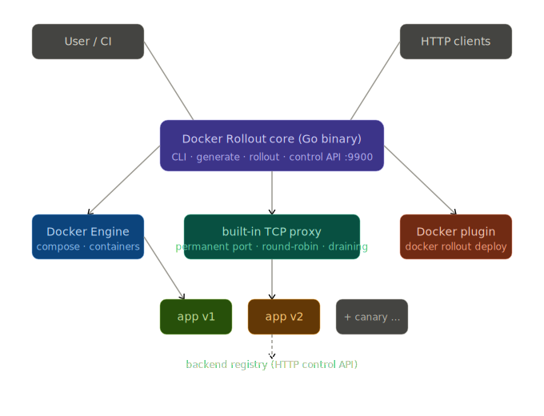

<div align="center">

# Orbit

**Production-grade zero-downtime deployments for Docker Compose — no Kubernetes, no Traefik, no external proxy.**

[](go.mod)
[](LICENSE)
[]()
[]()
[]()

[Quick Start](#quick-start) · [How It Works](#how-it-works) · [Commands](#commands) · [Constitution](CONSTITUTION.md)

</div>

---

**Note**: This project is unrelated to other open-source projects that also use the name "Orbit" (including OrbitDB, a peer-to-peer database, and Google Orbit, a C/C++ profiler). This Orbit is a Docker CLI plugin for Docker Compose deployment orchestration.

---

`docker-orbit` is a single Go binary you drop next to your existing `docker-compose.yml`. It injects its own built-in TCP proxy, writes a new `docker-rollout-compose.yml`, and from that point your host port **never goes dark again** — not during deployments, not during container restarts.

No sidecar. No service mesh. No changes to your app.

---

## Table of Contents

- [Why Orbit](#why-orbit)
- [Quick Start](#quick-start)
- [How It Works](#how-it-works)
- [What It Guarantees](#what-it-guarantees)
- [Installation](#installation)
- [Commands](#commands)
- [Docker CLI Plugin](#using-as-a-docker-cli-plugin)
- [Compose Integration](#compose-integration)
- [The Proxy Control API](#the-proxy-control-api)
- [Examples](#examples)
- [Comparison](#comparison-with-alternatives)
- [Documentation](#documentation)
- [Project Principles](#project-principles)
- [Building](#building)
- [License](#license)

---

## Why Orbit

When you run `docker compose up --force-recreate web`, Docker stops the old container and then starts the new one. That gap — usually under a second — is enough to drop HTTP connections, fail health checks in load balancers, and kill WebSocket sessions.

The standard fix is to add Traefik or nginx as a reverse proxy. That means learning new config formats, dealing with labels, and adding more moving parts to your stack — or reaching for Kubernetes, which solves the problem but brings a different order of operational complexity most Compose users don't need.

Orbit takes a third approach: it puts a tiny proxy in front of your service that **owns the host port permanently**. Your service becomes a replaceable backend behind that proxy. When you deploy a new version, the proxy routes traffic to the new container while the old one drains — and your clients never notice.

Built for teams running Docker Compose in production who need deployment safety without Kubernetes-scale infrastructure: small-to-medium production teams, platform engineers, self-hosted and edge deployments, and CI/CD pipelines.

---

## Quick Start

```bash
# 1. Build the docker-orbit binary
git clone https://github.com/docker-secret-operator/orbit.git
cd orbit
make build
# binary is now at ./bin/docker-orbit

# 2. Try the included test app
cd examples/testapp
cp .env.example .env
docker compose build
../../bin/docker-orbit generate
docker compose -f docker-rollout-compose.yml up -d

# 3. Open the UI at http://localhost:3000
# You'll see a live version monitor bar

# 4. Simulate a rollout — bump the API version and deploy
API_VERSION=2.0.0 docker compose build api
API_VERSION=2.0.0 ../../bin/docker-orbit rollout api \
  --file docker-rollout-compose.yml \
  --control-addr http://localhost:9901

# Watch the "api version" badge in the browser flip from 1.0.0 → 2.0.0
# Zero connections dropped.
```

---
## How It Works



You give Orbit your original compose file:

```yaml
services:
  api:
    image: myapp:v1
    healthcheck:
      test: ["CMD", "curl", "-f", "http://localhost:8080/health"]
      interval: 5s
      retries: 3
```

Run `docker-orbit generate`. It reads each service and applies four rules in priority order:

| # | Rule | Result |
|---|------|--------|
| 1 | Has `x-docker-rollout: skip: true` | Pass through unchanged |
| 2 | No `ports` declared | Pass through (workers, sidecars, etc.) |
| 3 | Image is a known database | Pass through, with a warning |
| 4 | Has `ports`, not a database | Proxy injected |

```
Parsed 2 service(s) — 1 eligible for proxy injection

Orbit Transform Summary:
  ✓ Enabling zero-downtime for service 'web'
  ⚠ Skipped 'db' (known database image)

Generated: docker-rollout-compose.yml
```

The generated file rewires things so the proxy permanently owns the host port:

```
Client :3000 → docker-rollout-proxy-web (permanent) → web:3000 (replaceable)
```

When you run `docker-orbit rollout web`, it:

1. Starts a second `web` container
2. Waits for its healthcheck to pass
3. Registers the new container with the proxy (`POST /backends`)
4. Marks the old container as draining — no new connections
5. Waits for in-flight requests to finish
6. Stops and removes the old container

Your clients see nothing. The proxy never dropped the port.

---

## What It Guarantees

Orbit makes explicit promises, defined in full in [CONSTITUTION.md](CONSTITUTION.md#4-product-contract):

| Guarantee | What it means |
|-----------|----------------|
| **Zero-downtime deployment** | No dropped connections during rollout, when health checks are properly defined and passing |
| **Deterministic crash recovery** | If Orbit crashes mid-deployment, recovery reaches a consistent state — no guessing |
| **Full Compose compatibility** | Your `docker-compose.yml` is never modified; disable Orbit anytime and Compose keeps working |
| **Single-binary deployment** | No databases, no external services, no distributed consensus — just the binary and Docker |
| **Configuration stability** | Environment variables and config format stay backward compatible within a major version |
| **Secure by default** | State files are `0600`, no secrets in logs, no outbound telemetry |

---

## Installation

Orbit is a single native binary — no Go, no source checkout, no container wrapper. Full matrix (platforms, upgrade, uninstall, checksum verification, local snapshot testing) in the **[Installation guide](docs/installation.md)**.

**Production — install script (recommended):**

```bash
curl -fsSL https://raw.githubusercontent.com/docker-secret-operator/orbit/main/install.sh | bash
```

Detects your OS/arch, downloads the release archive, **verifies its SHA256 checksum**, and installs `docker-orbit` as a Docker CLI plugin. Supported: Linux & macOS, amd64 & arm64. Linux users can alternatively install the `.deb`/`.rpm` from [Releases](https://github.com/docker-secret-operator/orbit/releases).

**Development — from source:**

```bash
git clone https://github.com/docker-secret-operator/orbit.git && cd orbit
make install-plugin      # build + install the local source as a plugin
# or: make dist          # build release archives/checksums/deb/rpm into ./dist
# or: go install github.com/docker-secret-operator/orbit/cmd/docker-orbit@latest
```

**Verify:**

```bash
docker orbit version
docker orbit doctor
```

> The old container-wrapper installer was retired — Orbit's CLI keeps host-side state (`/tmp`, `$XDG_STATE_HOME`) that an ephemeral container would lose. Native binary is the canonical install. See [docs/installation.md](docs/installation.md).

---

## Commands

| Command | Description |
|---------|-------------|
| [`generate`](#docker-orbit-generate) | Reads `docker-compose.yml`, writes `docker-rollout-compose.yml` |
| [`deploy <service>`](#docker-orbit-deploy-service) | Production deploy: pre-flight checks, plan preview, confirmation, progress, completion summary |
| [`rollout <service>`](#docker-orbit-rollout-service) | The underlying zero-downtime engine `deploy` wraps — unchanged, for scripts already depending on it |
| [`rollback <service>`](#docker-orbit-rollback-service) | Restore traffic to the previous version after a failed deployment |
| [`recover`](#docker-orbit-recover) | Trigger a deterministic recovery pass on demand and report the outcome |
| [`status`](#docker-orbit-status) | What is happening right now — generation, proxy health, backends, recovery state |
| [`history`](#docker-orbit-history) | What happened — the recorded rollout/rollback timeline for a service |
| [`doctor`](#docker-orbit-doctor) | Is everything healthy — a full diagnostic audit with remediation steps |
| `version` | Print the binary version |

Full flag reference for every command: [docs/cli-reference/](docs/cli-reference/) (auto-generated from the CLI itself — `make docs` to regenerate).

### `docker-orbit generate`

Reads your `docker-compose.yml` and writes `docker-rollout-compose.yml`. Your original file is never touched.

```bash
docker-orbit generate
docker-orbit generate --file docker-compose.prod.yml --output docker-rollout-compose.prod.yml
```

| Flag | Default | Description |
|------|---------|-------------|
| `--file`, `-f` | `docker-compose.yml` | Input compose file |
| `--output`, `-o` | `docker-rollout-compose.yml` | Output file path |

### `docker-orbit deploy <service>`

The production entry point for deploying a new version: the same zero-downtime engine `rollout` calls, wrapped with pre-flight safety checks (the same checks `doctor` runs), a plan preview, a confirmation prompt, live progress reporting, and a completion summary. Build your new image first, then run this.

```bash
docker-orbit deploy web
docker-orbit deploy web --dry-run                  # show the plan, change nothing
docker-orbit deploy web --yes --json                # non-interactive, for CI
docker-orbit deploy web --project myapp             # verify the target proxy first
```

| Flag | Default | Description |
|------|---------|-------------|
| `--file`, `-f` | `docker-rollout-compose.yml` | Orbit compose file |
| `--control-addr` | `http://localhost:9900` | Proxy control API address |
| `--project` | | Verify the queried proxy reports this service/project name |
| `--pull` | `false` | Pull latest image before deploying |
| `--timeout`, `-t` | `60s` | How long to wait for the new container's healthcheck |
| `--drain`, `-d` | `5s` | How long to let in-flight requests finish on the old container |
| `--dry-run` | `false` | Show the deployment plan without executing it |
| `--yes`, `-y` | `false` | Skip the confirmation prompt (required for non-interactive/CI use) |
| `--json` | `false` | Output as JSON |
| `--force-unlock` | `false` | Force unlock if a previous deploy process died (only after verifying it's gone) |

Before touching anything, `deploy` runs the same checks `doctor` does — Docker reachable, compose file valid, proxy reachable and healthy, recovery state consistent — and aborts with no changes made if any of them fail. For `deploy` specifically (unlike a general `doctor` run, where it's expected before your first deploy), an unreachable or unhealthy proxy is a hard block: there's nowhere to register the new backend without one.

Example plan preview (`--dry-run`), captured against a live proxy:

```
$ docker-orbit deploy web --file docker-rollout-compose.yml --control-addr http://localhost:19900 --dry-run
Deployment plan for "web"

Compose file:         docker-rollout-compose.yml
Current generation:   (none — first deploy)
Proxy status:         recovering
Healthy backends:     1
Unhealthy backends:   0
Healthcheck timeout:  1m0s
Drain period:         5s

Steps that will run:
  1. Acquire deployment lock (prevents a concurrent deploy for this service)
  2. Optional: pull the new image (--pull)
  3. Scale the service +1 (start the new container alongside the old one)
  4. Wait for the new container's healthcheck to pass (or --timeout)
  5. Register the new container with the proxy — traffic starts splitting
  6. Save rollback state (enables 'docker orbit rollback' if this fails)
  7. Drain the old container for --drain, then remove it
  8. Deregister the old backend and the initial seed backend

Pre-flight checks:
  ✓ PASS  Docker Engine reachable
  ✓ PASS  Docker Compose available
  ✓ PASS  Compose file
  ✓ PASS  Orbit configuration valid
  ✓ PASS  Proxy reachable
  ⚠ WARN  Proxy healthy
  ⚠ WARN  Required ports available
  ✓ PASS  Recovery state consistent
  ✓ PASS  State directory writable
  ⚠ WARN  Plugin installation
```

On execution (no `--dry-run`), each phase is reported as it happens — `pulling`, `scaling_up`, `health_check`, `registering`, `draining`, `deregistering`, `complete` — followed by a completion summary with the resulting generation and backend health.

### `docker-orbit rollout <service>`

The zero-downtime engine itself, unchanged since before `deploy` existed — kept for scripts and pipelines already depending on its exact behavior. New usage should prefer `deploy`, which wraps this same engine with production safety on top (see [CONSTITUTION.md](CONSTITUTION.md)'s "Backward Compatibility Whenever Practical").

```bash
docker-orbit rollout web --file docker-rollout-compose.yml --control-addr http://localhost:9901
docker-orbit rollout web --pull --timeout 120s --drain 10s
```

| Flag | Default | Description |
|------|---------|-------------|
| `--file`, `-f` | `docker-rollout-compose.yml` | Orbit compose file |
| `--control-addr` | `http://localhost:9900` | Proxy control API address |
| `--pull` | `false` | Pull latest image before starting |
| `--timeout`, `-t` | `60s` | How long to wait for the new container's healthcheck |
| `--drain`, `-d` | `5s` | How long to let in-flight requests finish on the old container |
| `--api-token` | `$ORBIT_API_TOKEN` | Bearer token if you secured the control API |

> **Finding the right `--control-addr`:** By default, Orbit maps each proxy's control port to the host at `service_host_port + 6900`. So if your service runs on port `3001`, the control API is at `http://localhost:9901`. If it runs on port `3000`, it's at `http://localhost:9900`.

### `docker-orbit rollback <service>`

If something went wrong after a deploy, this restores traffic to the previous version without redeploying: re-registers the old backend, drains the new (failing) one, and removes it. Shows a preview and expected impact before doing anything, same as `deploy`.

```bash
docker-orbit rollback api --control-addr http://localhost:9901
docker-orbit rollback api --dry-run
docker-orbit rollback api --yes --json
```

| Flag | Default | Description |
|------|---------|-------------|
| `--control-addr` | (from saved state) | Override proxy control API address |
| `--drain`, `-d` | (from saved state, else `5s`) | Override drain period |
| `--to` | | Roll back to a specific generation — see limitation below |
| `--dry-run` | `false` | Show the rollback plan without executing it |
| `--yes`, `-y` | `false` | Skip the confirmation prompt |
| `--json` | `false` | Output as JSON |

Rollback reads the state file `deploy`/`rollout` saved during the last run (`/tmp/orbit-<service>-state.json`). If that file is gone, rollback can't run — deploy the previous image manually instead. **`--to` cannot roll back to an arbitrary earlier generation**: Orbit's state model records exactly one prior generation per service, cleared once a deploy completes and the old container is removed, so `--to` can only confirm the one target that's actually recoverable — see [docs/troubleshooting.md](docs/troubleshooting.md) for the full reasoning.

Real rollback session, captured end to end against a live proxy (log lines from the underlying engine elided for readability):

```
$ docker-orbit rollback smoketest --yes
Rollback plan for "smoketest"

Restore target:  web-gen1-abc123 (127.0.0.1:18080)
Draining:        web-gen2-def456
Reason:          restoring the generation active before the last rollout/deploy
Drain period:    2s

Expected impact: smoketest traffic returns to web-gen1-abc123; web-gen2-def456 is drained and removed
  → [restoring] restoring web-gen1-abc123 (127.0.0.1:18080)
  → [draining] draining web-gen2-def456 for 2s
  → [deregistering] removing web-gen2-def456
  → [complete] smoketest restored to web-gen1-abc123

✓ Rollback complete (2004ms)

Restored to:   web-gen1-abc123
Proxy status:  recovering
```

### `docker-orbit recover`

Triggers a real, on-demand recovery pass — the identical recovery Orbit runs automatically at proxy startup (rediscovering live backends, determining which generation should hold traffic from persisted authority state, reconciling the proxy's registry), available without restarting the proxy container. Useful after manually restarting containers, or to confirm recovery would succeed before relying on it.

```bash
docker-orbit recover
docker-orbit recover --json
docker-orbit recover --control-addr http://localhost:9901
```

| Flag | Default | Description |
|------|---------|-------------|
| `--control-addr` | `http://localhost:9900` | Proxy control API address |
| `--project` | | Verify the queried proxy reports this service/project name |
| `--timeout` | `30s` | Max time to wait — Docker discovery + health checks can take longer than a status query |
| `--json` | `false` | Output as JSON |

Recovery is deterministic and **never guesses**: if it can't establish an authoritative generation — no persisted authority state and no healthy generation to infer one from — it stops and says exactly that, rather than picking one arbitrarily. Real output, captured against a live proxy with no persisted authority state:

```
$ docker-orbit recover --control-addr http://localhost:19900
Inspecting "smoketest"...
  Current state: idle (proxy: recovering)

Triggering recovery...

✗ Recovery could not establish an authoritative generation.
  Reason: no healthy generations found

  This is not a guess-and-hope situation: Orbit found no persisted authority
  state and no healthy generation to infer one from, and stopped rather than
  pick one arbitrarily. Check container health (docker ps, docker logs) and
  re-run once at least one generation is healthy.
```

This is the honest outcome for a proxy with a live registered backend but no real Docker container or persisted rollout state behind it (as in this captured session) — recovery re-derives authority independently of whatever's currently registered, rather than trusting it. A normal recovery against a real deployment reports `✓ Recovery complete` with the restored generation and backend counts.

### `docker-orbit status`

Answers "what is happening right now" — active generation, deployment phase, proxy health, live backend health (checked at request time, not cached), and recovery state. Every field is discovered from the running proxy on each call.

```bash
docker-orbit status
docker-orbit status --json
docker-orbit status --watch                          # redraw every --interval (default 2s) until Ctrl-C
docker-orbit status --control-addr http://localhost:9901
docker-orbit status --project myapp                   # verifies the queried proxy reports service "myapp"
```

Example session:

```
$ docker-orbit status --control-addr http://localhost:19901 --project smoketest2
Service:                    smoketest2
Runtime version:            0.2.0
Proxy status:               ready
Current generation:         web-3
Previous generation:        web-2
Deployment state:           idle
Healthy backends:           2
Unhealthy backends:         0
Active traffic target:      172.18.0.4:8080, 172.18.0.5:8080
Recovery — total / failed:  1 / 0
Recovery — degraded:        false
```

### `docker-orbit history`

Answers "what happened" — the recorded rollout/rollback timeline for a service, newest first. Entries are written as `rollout`/`rollback` actually run; there is no retroactive record of deployments from before this feature existed, and the command says so explicitly on an empty log rather than implying data loss.

```bash
docker-orbit history
docker-orbit history --project myapp
docker-orbit history --limit 20
docker-orbit history --json
```

Example session:

```
$ docker-orbit history --project web
History for "web"

TIME                 TYPE                RESULT   DURATION  TRIGGER  DETAIL
2026-07-02 10:56:40  rollout_completed   success  4213ms    cli      web-abc123 → web-def456
2026-07-01 09:12:03  rollback            success  1802ms    cli      web-def456 → web-abc123
2026-07-01 09:10:15  rollout_failed      failure  60011ms   cli      healthcheck timeout after 60s
```

### `docker-orbit doctor`

Answers "is everything healthy" — a full diagnostic audit: Docker Engine connectivity, compose file validity, control API configuration, proxy reachability and readiness, recovery-state consistency, state-directory permissions, and plugin installation. Every check performs a real probe; nothing is simulated. Anything that isn't `PASS` includes a concrete next step.

```bash
docker-orbit doctor
docker-orbit doctor --json
docker-orbit doctor --file docker-compose.prod.yml
docker-orbit doctor --control-addr http://localhost:9901
```

Example session (proxy not yet running — every WARNING here is expected before a first deploy):

```
$ docker-orbit doctor
✓ PASS  Docker Engine reachable    Docker daemon responded to ping
⚠ WARN  Compose file               docker-compose.yml not found in the current directory
                                     → Run doctor from your project directory, or pass --file <path>
✓ PASS  Orbit configuration valid  control address and environment look valid
⚠ WARN  Proxy reachable            no response from http://localhost:9900: connection refused
                                     → If you expect a proxy to be running: docker ps --filter name=docker-rollout-proxy. If not, this is expected before your first `docker orbit generate` + deploy
⚠ WARN  Proxy healthy              readiness endpoint unreachable — see 'Proxy reachable' check
                                     → Resolve proxy connectivity first
⚠ WARN  Recovery state consistent  could not fetch status — see 'Proxy reachable' check
                                     → Resolve proxy connectivity first
✓ PASS  State directory writable   /home/user/.local/share/orbit is writable
⚠ WARN  Plugin installation        docker-orbit not found on PATH or in a known Docker CLI plugins directory
                                     → Run: sudo make install-plugin (or copy this binary to ~/.docker/cli-plugins/docker-orbit) to use 'docker orbit' instead of the standalone binary

3 passed, 5 warning, 0 error
```

`doctor` exits `0` when there are zero `ERROR`s (warnings are informational); exit code `4` when at least one check reports `ERROR` — see [docs/cli-reference/](docs/cli-reference/) and `internal/cli/output` for Orbit's full exit-code contract.

---

## Using as a Docker CLI plugin

After `sudo make install-plugin`, every Orbit command works through the Docker CLI:

```bash
docker orbit generate
docker orbit rollout web --control-addr http://localhost:9901
docker orbit status
docker orbit history
docker orbit doctor
docker orbit --help
```

The plugin binary is identical to the standalone `docker-orbit` binary — mode is auto-detected from `argv[0]` and the Docker CLI plugin environment.

---

## Compose Integration

<details>
<summary><strong>Opting a service out</strong> — <code>x-docker-rollout: skip: true</code></summary>

Add `x-docker-rollout: skip: true` to keep a service exactly as-is. No proxy will be injected.

```yaml
services:
  admin:
    image: myapp:latest
    ports:
      - "9000:9000"
    x-docker-rollout:
      skip: true
```

The `x-docker-rollout` block is stripped from the generated file so Docker never sees it.

</details>

<details>
<summary><strong>Multi-port services</strong></summary>

Multiple ports work natively — one proxy listener per port:

```yaml
services:
  frontend:
    image: nginx:alpine
    ports:
      - "80:80"
      - "443:443"
```

The proxy gets both `80:80` and `443:443`. Both stay live during rollouts.

</details>

<details>
<summary><strong>Databases are always excluded</strong></summary>

Orbit never proxies these images — they're stateful and a TCP proxy in front of them causes more problems than it solves:

`postgres`, `mysql`, `mariadb`, `redis`, `mongo`, `elasticsearch`, `opensearch`,
`cassandra`, `couchdb`, `influxdb`, `rabbitmq`, `kafka`, `zookeeper`,
`mssql`, `clickhouse`, `minio`, `vault`

Matching strips registry prefixes and tags — `docker.io/library/postgres:16` and `bitnami/postgres:latest` both match. If Orbit auto-detects your service as a database but you want to proxy it anyway, `x-docker-rollout: skip: false` is not enough — the detector takes priority. You'd need to contribute a flag to override it.

</details>

---

## The proxy control API

Each `docker-rollout-proxy-<service>` container runs a small HTTP API for backend management. This is what `docker-orbit rollout` calls internally, but you can use it directly from scripts.

The control port is mapped to your Docker host at `service_host_port + 6900`:
- Service at `:3000` → control API at `http://localhost:9900`
- Service at `:3001` → control API at `http://localhost:9901`
- Service at `:8080` → control API at `http://localhost:14980`

| Method | Path | Description |
|--------|------|-------------|
| `GET` | `/health` | Liveness check |
| `GET` | `/backends` | List all backends with request counts |
| `POST` | `/backends` | Register a new backend |
| `PUT` | `/backends/{id}/drain` | Stop sending new connections to a backend |
| `DELETE` | `/backends/{id}` | Remove a backend |

---

## Examples

| Example | What it demonstrates |
|---------|---------------------|
| [`examples/testapp/`](examples/testapp/) | Full working app with live rollout monitor in the browser |
| [`examples/basic/`](examples/basic/) | Minimal single-service setup |
| [`examples/advanced/`](examples/advanced/) | Multi-service stack with `x-docker-rollout: skip` |
| [`examples/multi-port/`](examples/multi-port/) | Multiple host ports on one service |
| [`examples/production/`](examples/production/) | Nginx + TLS + Prometheus in front of Orbit |
| [`examples/scripts/`](examples/scripts/) | Safe rollout script with auto-rollback on error |

---

## Comparison with alternatives

|  | Traefik + labels | Dokku | **Orbit** |
|--|---------------|-------|-----------|
| Works with existing `docker-compose.yml` | ✅ | ❌ | ✅ |
| No external proxy required | ❌ needs Traefik itself | ❌ built-in nginx | ✅ built-in |
| Host port stays live during rollout | ✅ | ✅ | ✅ |
| HTTP backend management API | ❌ | ❌ | ✅ |
| Database auto-exclusion | ❌ | ❌ | ✅ |
| No root/server required | ✅ | ❌ | ✅ |
| Docker CLI plugin | ❌ | ❌ | ✅ |

Traefik and nginx-based approaches require running and configuring a separate reverse proxy already. Orbit includes the proxy, so you don't need to bring your own.

---

## Documentation

| Doc | Description |
|-----|-------------|
| [CONSTITUTION.md](CONSTITUTION.md) | Product vision, guarantees, engineering principles, governance |
| [BRAND.md](BRAND.md) | Frozen brand specification and naming conventions |
| [PRODUCT.md](PRODUCT.md) | Who Orbit is for, supported platforms, capability status |
| [CHANGELOG.md](CHANGELOG.md) | Notable changes |
| [docs/adr/ADR-0003-deployment-engine-architecture.md](docs/adr/ADR-0003-deployment-engine-architecture.md) | CLI-only vs proxy architecture explained |
| [docs/docker-image-build.md](docs/docker-image-build.md) | Docker image build and publication |
| [docs/governance/](docs/governance/) | Contribution workflow, quality standards, release policy, security, state, observability |
| [docs/adr/](docs/adr/) | Architectural Decision Records |
| [docs/cli-reference/](docs/cli-reference/) | Full CLI flag reference, auto-generated from the command tree |
| [docs/deployment-guide.md](docs/deployment-guide.md) | End-to-end walkthrough: validate, deploy, roll back, recover |
| [docs/troubleshooting.md](docs/troubleshooting.md) | Common problems, mapped to the real `docker orbit doctor` checks that catch them |

---

## Project Principles

Orbit is governed by [CONSTITUTION.md](CONSTITUTION.md) — the permanent reference for the project's vision, product contract, engineering principles, and non-goals. Everything in this codebase is measured against one rule:

> **Orbit exists to make Docker Compose deployments safer — not more complicated.**

Contributing? Start with [docs/governance/CONTRIBUTING.md](docs/governance/CONTRIBUTING.md) and [docs/governance/QUALITY.md](docs/governance/QUALITY.md) (the Definition of Done every change is held to).

---

## Building

```bash
make build              # ./bin/docker-orbit
make test               # stable suite, -race, ~30s (includes internal/stack, internal/state)
make test-soak          # chaos + extended-load suites — slow, minutes not seconds
make docker-build       # orbit/proxy:latest
make install-plugin     # /usr/local/lib/docker/cli-plugins/docker-orbit
make lint               # golangci-lint run
```

**Technical notes:**

- **TCP proxy:** pure `net` package, no CGO, no system dependencies
- **Round-robin:** lock-free `atomic.Uint64` counter, deterministic backend ordering
- **Registry:** `sync.RWMutex` + heap-allocated `*atomic.Uint64` per backend (race-safe struct copies)
- **Port ownership:** listener opened once at `docker compose up`, never closed during rollouts
- **Half-close:** bidirectional `io.Copy` with `CloseWrite()` for correct TCP teardown
- **Tests:** 212 unit tests in the stable suite, race detector clean (`make test`); `internal/stack` and `internal/state` have known, tracked issues — see CHANGELOG.md

---

## License

MIT. See [LICENSE](LICENSE).
