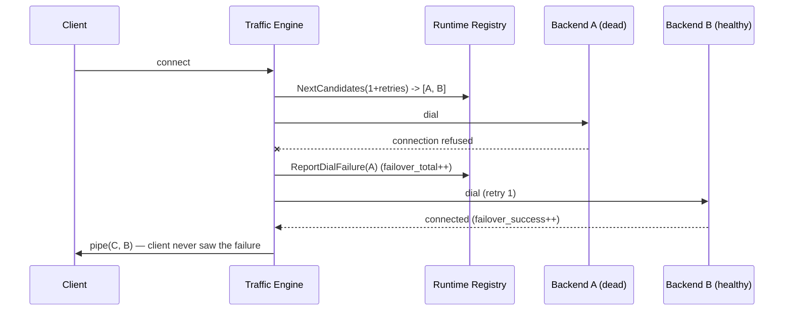
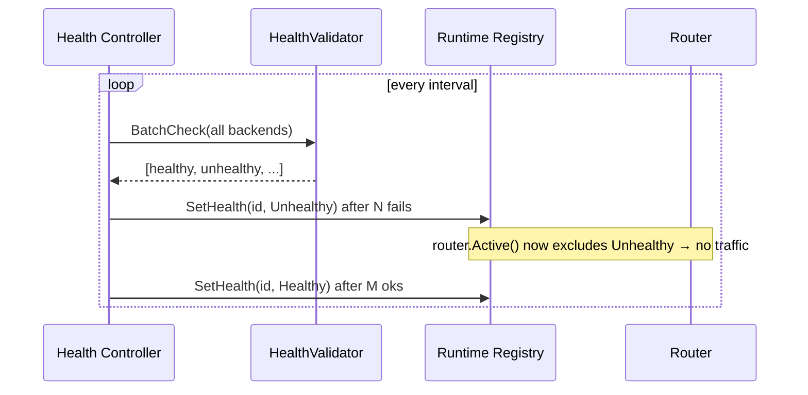
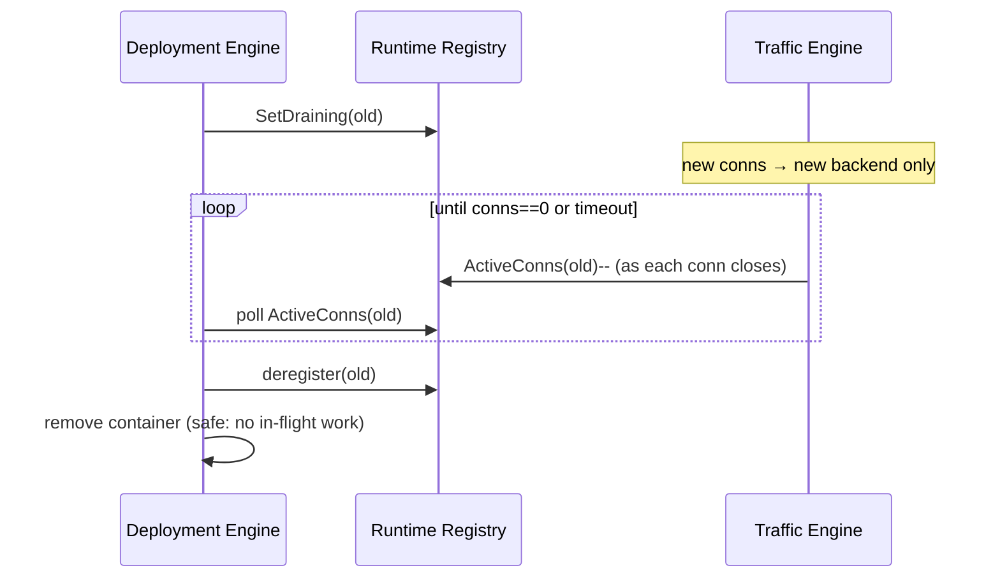

# Orbit — Production Runtime Design (Phase 3.2)

> **Status: DESIGN ONLY.** No production code changes accompany this document.
> It specifies how Orbit evolves from a deployment tool into a production
> *runtime* by strengthening the guarantees around the existing, unchanged
> deployment engine (`internal/rollout`) and traffic proxy (`internal/proxy`).
> Companion: [runtime validation](../../README.md) and
> [stack-orchestration.md](stack-orchestration.md) (the separate v2 track).

Orbit's defining capability is a **stable runtime endpoint decoupled from
container lifecycle**: the proxy owns the host port permanently
([server.go `Bind`](../../internal/proxy/server.go)), so backend containers can
be replaced without the port going dark. Every design below hardens that
runtime along five axes: **availability, reliability, traffic continuity,
recovery, operator confidence.** None adds a new deployment strategy.

---

## 1. Runtime Architecture Review

### 1.1 Current data path (as built)
```
Accept (per-port listener, never closed during deploys)
   └─ handleConn:
        backend := router.Next()          // atomic round-robin over Active()
        upstream := dialer.Dial(backend)   // ONE attempt
        if dial fails → ConnFailed(); close client   // ← no failover
        pipe(client, upstream)             // bidirectional io.Copy + CloseWrite
```

### 1.2 Confirmed gaps (from the validation phase)
| Gap | Evidence | Runtime axis |
|---|---|---|
| **No data-path failover** — a registered-but-dead backend drops its round-robin share | `handleConn` dials once, returns on failure | Reliability |
| **No continuous health** — backends are health-checked only *before* registration | `HealthValidator` exists in `health.go` but no loop calls it to evict | Availability |
| **Time-bounded drain** — old container killed at `--drain` deadline regardless of in-flight work | `rollout.go` removes container after fixed `time.After(Drain)` | Traffic continuity |
| **Global, not per-backend, connection accounting** | `Server.activeConns` is one `sync.WaitGroup` for all ports | Traffic continuity |
| **Registry lacks runtime state** — only `Draining bool`, no Failed/Unhealthy/Healthy, no per-backend conn count | `Registry.Backend` fields | Operator confidence |

### 1.3 Target runtime architecture
```
                 Client
                    │  (TCP conn to the stable, permanent proxy port)
                    ▼
        ┌──────────────────────────────────────────┐
        │            Traffic Engine                 │  (server.go + router.go)
        │  route → dial → FAILOVER(retry next) → pipe│
        │  per-conn lifecycle + per-backend counters │
        └───────────────┬───────────────────────────┘
                        │ reads/writes runtime state
                        ▼
        ┌──────────────────────────────────────────┐
        │           Runtime Registry                │  (authoritative)
        │  state machine per backend: Active /       │
        │  Draining / Unhealthy / Failed             │
        │  + conn counts + generation + metadata     │
        └───────┬───────────────────────┬───────────┘
                ▲ health transitions     ▲ register/drain/deregister
                │                        │
     ┌──────────────────┐      ┌──────────────────────┐
     │ Health Controller│      │  Deployment Engine    │  (internal/rollout —
     │ (periodic probes)│      │  Run / Rollback       │   UNCHANGED contract)
     └──────────────────┘      └──────────────────────┘
```

---

## 2. Passive Failover Design (Phase 1)

**Goal:** a single dial failure never disconnects the client if another healthy
backend exists.

### 2.1 Behavior
```
route → pick primary (round-robin)
      → dial primary
          success → pipe
          failure → mark primary Unhealthy (report to registry)
                  → pick next candidate (healthy, non-draining, non-failed, not-yet-tried)
                  → dial candidate            (retry budget: default 1)
                      success → pipe (record failover_success)
                      exhausted → close client (record failover_failure)
```

### 2.2 Requirements → design
| Requirement | Design |
|---|---|
| Retry another **healthy** backend | Traffic engine requests an *ordered candidate list* from the router, not a single pick |
| Never retry **draining** | Candidate list = `registry.Active()` (already excludes draining) minus Unhealthy/Failed |
| Never retry **permanently failed** | New `Failed` state (§4) is excluded from candidates |
| Retry **once by default** | `ORBIT_FAILOVER_RETRIES` (default `1`); 0 disables |
| **Deterministic routing** | Primary still chosen by the existing atomic round-robin counter; candidates are the deterministic sorted `Active()` order starting after the primary. No randomness. |

### 2.3 Proposed seam (no behavior change until implemented)
```go
// Router gains a candidate iterator; Next() keeps its meaning for callers that
// only want one. Failover uses NextCandidates.
func (r *Router) NextCandidates(max int) ([]*Backend, error) // primary first, deterministic order

// Traffic engine records, on dial failure, an advisory signal:
registry.ReportDialFailure(id) // increments failure count; health controller decides eviction
```
The traffic engine performs *at most* `retries` extra dials, iterating the
candidate list, skipping any backend whose state is no longer routable.

### 2.4 Measurements (feed Phase 6)
`orbit_failover_total`, `orbit_failover_success_total`,
`orbit_failover_failure_total`, and a retry-latency histogram
(`orbit_failover_retry_seconds`).

### 2.5 Sequence


---

## 3. Continuous Health Controller Design (Phase 2)

**Goal:** routing always reflects *current* runtime health, not a snapshot from
registration time.

### 3.1 Component
A single background controller (one goroutine per proxy) owning a ticker.
Reuses the existing `HealthValidator` ([health.go](../../internal/proxy/health.go):
Docker `HEALTHCHECK` status with TCP-dial fallback).

```go
type HealthController struct {
    reg      *Registry
    hv       *HealthValidator
    interval time.Duration   // ORBIT_HEALTH_INTERVAL (default 5s)
    failThreshold int        // consecutive fails → evict   (default 3)
    riseThreshold int        // consecutive oks → reintroduce (default 2)
}
func (h *HealthController) Run(ctx context.Context) // ticker loop; ctx cancel = stop
```

### 3.2 State transitions (hysteresis prevents flapping)
```
Healthy --(failThreshold consecutive fails)--> Unhealthy   (removed from routing)
Unhealthy --(riseThreshold consecutive oks)--> Healthy     (reintroduced)
Unhealthy --(container gone / deregistered)--> Failed      (terminal until re-registered)
```

### 3.3 Responsibilities
- Periodically `BatchCheck` all registered backends (bounded concurrency — the
  validator already supports `maxConcurrent`).
- On threshold breach, transition the backend's state in the registry so the
  router stops selecting it (it is **not** deleted — deletion stays a
  deployment-engine action, preserving ownership boundaries).
- Reintroduce on recovery.
- Publish every transition as a health-change event (feeds
  `orbit_backend_health_changes_total` and structured logs).

### 3.4 Interaction rule
The controller only **flips runtime health state**; it never removes backends,
never touches Docker, never switches generations. Removal/registration remain
the deployment engine's job (§4 ownership).

### 3.5 Sequence


---

## 4. Runtime Registry Design (Phase 4)

**Goal:** one authoritative source of backend truth; the deployment engine
talks to the registry, not to proxy internals.

### 4.1 Backend state machine
```
                 register
                    │
                    ▼
   ┌──────────► Active ──────────┐
   │            │  ▲              │ SetDraining
   │  SetHealthy│  │SetHealth     ▼
   │            │  │(Unhealthy) Draining
   │            ▼  │              │ (conns==0 | timeout)
   └──────── Unhealthy            ▼
                    │        deregister → (removed)
                    ▼
                 Failed (terminal until re-register)
```

### 4.2 Extended backend record (design)
| Field | Owner that writes it |
|---|---|
| `ID`, `Addr`, `Generation`, `AddedAt` | Deployment Engine (register) |
| `State` (Active/Draining/Unhealthy/Failed) | Draining ← Deployment; Unhealthy/Failed ← Health Controller |
| `ActiveConns` (atomic) | Traffic Engine (inc on dial, dec on close) |
| `Requests` (atomic, existing) | Traffic Engine |
| `LastHealthChange`, `FailureStreak` | Health Controller |

`Router.Active()` becomes "state == Active" (currently "!Draining"), so both
draining **and** unhealthy/failed are excluded from routing by construction.

### 4.3 Ownership matrix (the load-bearing contract)
| Actor | May write | May read | Must NOT |
|---|---|---|---|
| **Deployment Engine** (`rollout`) | register, SetDraining, deregister, generation | all | probe health; count connections; pick routes |
| **Runtime Registry** | (owns the state machine + invariants) | — | perform I/O (pure in-memory authority) |
| **Health Controller** | SetHealth (Unhealthy/Healthy), streaks | all | delete backends; touch Docker; switch traffic |
| **Traffic Engine** (`server`/`router`) | ActiveConns, Requests, ReportDialFailure | Active/candidates | change generation; delete backends |

This makes the registry the single writer-arbitrated authority and keeps the
deployment engine from manipulating proxy state directly (the current
`SetDraining`/`Remove` calls from rollout become the *only* deployment→registry
verbs).

---

## 5. Intelligent Connection Draining Design (Phase 3)

**Goal:** finish in-flight work (WebSocket/SSE/gRPC/keep-alive) before removing
a backend, instead of a fixed 5s guillotine.

### 5.1 Model
```
Begin drain (SetDraining)         → router stops selecting it (new conns rejected)
   └─ wait until ActiveConns(id)==0  OR  drainTimeout reached
        └─ deregister + remove container
```

### 5.2 Requirements → design
| Requirement | Design |
|---|---|
| Accurate active-conn tracking | Per-backend atomic `ActiveConns` (§4); `handleConn` inc after successful dial, dec in the defer |
| Configurable timeout | `--drain` (existing) becomes the *ceiling*, not the *exact* wait; `ORBIT_DRAIN_TIMEOUT` for the proxy default |
| Immediate override | `--drain 0` or `?force=true` on `DELETE /backends/{id}` → skip the wait |
| Emit drain progress | Poll loop emits `(id, remaining_conns, elapsed)` to logs + `orbit_connections_draining` gauge |

### 5.3 Where the wait moves
Today the wait is a `time.After(Drain)` inside `rollout.Run`. In the runtime
model, the **drain-until-empty wait belongs to the runtime** (the proxy knows
the live connection count; the deployment engine does not). Design: the
deployment engine issues drain, then calls a runtime endpoint
`POST /backends/{id}/await-drain?timeout=…` (or polls `GET /backends/{id}`
until `ActiveConns==0`), then removes the container. This keeps connection
truth in the runtime and ordering control in the engine.

### 5.4 Sequence


---

## 6. Traffic Engine Review (Phase 5)

| Aspect | Current | Recommendation |
|---|---|---|
| Routing algorithm | atomic round-robin over `Active()` — lock-free, deterministic | keep; extend to candidate iterator (§2) |
| Retry behavior | none | add bounded failover (§2) |
| Connection lifecycle | `Add(1)` before goroutine, `Done()` in defer — correct for global drain | add per-backend counter (§5) |
| Socket handling | `CloseWrite` half-close via `io.Copy` both directions | keep — this is already correct TCP teardown |
| Graceful shutdown | `CloseGraceful` waits on global `activeConns` with timeout | keep; report per-backend residuals in logs |
| Backpressure | unbounded accept → unbounded goroutines | add optional `ORBIT_MAX_CONNS` cap + accept throttle; shed with a clear metric |
| Metrics | ConnStart/End/Failed + per-backend requests | add §7 runtime metrics |
| Logging | debug-level per-conn; warn on dial fail | keep warn on failover-exhausted; move happy path to debug (already the case) |

**Determinism + observability principle:** every routing decision (primary
pick, each failover hop, eviction, drain completion) must emit a metric and a
structured log field, so operators never need debug logs to explain a
connection's fate.

---

## 7. Runtime Metrics Specification (Phase 6)

| Metric | Type | Labels | Meaning |
|---|---|---|---|
| `orbit_backends_active` | gauge | — | backends in `Active` state |
| `orbit_backends_draining` | gauge | — | backends in `Draining` |
| `orbit_backends_unhealthy` | gauge | — | backends in `Unhealthy` |
| `orbit_backends_failed` | gauge | — | backends in `Failed` |
| `orbit_connections_active` | gauge | `backend` | live proxied connections |
| `orbit_connections_draining` | gauge | `backend` | live connections on draining backends |
| `orbit_failover_total` | counter | — | dial failures that triggered a retry |
| `orbit_failover_success_total` | counter | — | retries that connected |
| `orbit_failover_failure_total` | counter | — | retries exhausted → client dropped |
| `orbit_backend_health_changes_total` | counter | `backend`,`from`,`to` | state transitions |
| `orbit_connection_duration_seconds` | histogram | — | proxied connection lifetime |
| `orbit_failover_retry_seconds` | histogram | — | added latency from failover |

All exposed on the existing unauthenticated `GET /metrics` (internal network
only), extending `metrics.WritePrometheus`. No debug logging required for
runtime visibility.

## 8. State Model (consolidated)

| Layer | State | Persistence |
|---|---|---|
| **Runtime (this phase)** | backend state machine, conn counts, health streaks | **in-memory only** (rediscovered on proxy restart via existing recovery) |
| **Deployment** | generation, rollout in-flight, rollback state | `internal/state` + `/tmp/orbit-<svc>-state.json` (unchanged) |

Runtime state is intentionally ephemeral: on restart, the existing recovery
(`internal/state` + rollout recovery) rediscovers backends, and the health
controller re-establishes health within one interval. **No new persistence.**

## 9. Updated Product Positioning (Phase 7)

**Remove** any language implying Orbit replaces Kubernetes or is a service mesh.
**Adopt** consistently:

> **Orbit — production deployments for Docker Compose.**
> A stable runtime endpoint, decoupled from container lifecycle.

```
Client
   ↓
Orbit Runtime   ← the stable endpoint (this is the product)
   ↓
Backend Containers
```

Honest capability claims (aligned to the validation phase):
- ✅ "Zero-downtime **rollouts**" — the backend swap drops no new connections.
- ✅ "Passive failover and continuous health" — *once this phase's designs ship.*
- ✅ "Graceful connection draining."
- ❌ Do **not** claim HA, multi-host, or K8s-equivalence — see roadmap §11.
- Always name the mechanism: *the proxy is the stable endpoint; guarantees hold
  while the proxy is running (single-instance today).*

## 10. Performance Benchmarks (design of the suite)

Design-only; numbers to be captured when implemented. Extend
`internal/testing/benchmark` and `internal/testing/chaos`:

| Benchmark / test | Measures | Target |
|---|---|---|
| Backend crash test | connection survival rate during a mid-flight backend kill | ≥ 99% new conns succeed via failover |
| Runtime failover latency | added latency of one retry hop | < 10ms p99 (local mesh) |
| Connection draining test | % long-lived conns that finish before removal | 100% within drain ceiling |
| Long-lived connection test (WS/gRPC) | conns surviving a full rollout | all, unless they exceed the drain ceiling |
| Health transition test | detection→eviction latency | ≤ `failThreshold × interval` |
| Runtime availability (soak) | port-bound uptime % across N rollouts | 100% (proxy never rebinds) |

Validation gates for the eventual implementation:
`go build ./...`, `go test ./...`, `go test -race ./...`, `go vet ./...`,
`golangci-lint run ./...`.

## 11. Production Readiness Assessment

| Property | Today | After this phase's designs ship | Still open (roadmap) |
|---|---|---|---|
| Stable endpoint | ✅ | ✅ | proxy HA |
| Backend failure handling | ❌ drops share | ✅ passive failover | — |
| Continuous health | ❌ | ✅ controller | — |
| Long-lived connection continuity | ⚠️ 5s guillotine | ✅ drain-to-empty | — |
| Authoritative backend view | ⚠️ partial | ✅ runtime registry | — |
| Proxy availability | ⚠️ SPOF | ⚠️ SPOF | **proxy HA / multi-proxy** |
| Auto-rollback on runtime regression | ❌ | (health signals enable it) | wire into deployment engine |

**Assessment:** the four designs (failover, health controller, drain-to-empty,
runtime registry) close the *reliability and traffic-continuity* gaps and make
the single-proxy runtime production-grade for backend lifecycle. The remaining
production gap after this phase is **proxy availability itself** (single
instance), addressed in the roadmap below — not in this phase.

## 12. Future Runtime Roadmap (Phase 8 — documented, not implemented)

| Item | Problem it solves | Sketch |
|---|---|---|
| **Proxy high availability** | proxy is a SPOF; its own upgrade rebinds the port | run ≥2 proxy instances behind a shared listener |
| **Multi-proxy architecture** | horizontal scale + rolling proxy upgrades | multiple proxies sharing a registry view |
| **`SO_REUSEPORT` evaluation** | zero-downtime proxy upgrades on Linux | kernel-load-balanced multiple listeners on the same port; evaluate fairness + drain semantics |
| **Runtime clustering** | shared backend/health state across proxies | gossip or a small consensus layer for registry replication |
| **Runtime failover** | proxy-instance death without outage | health-checked proxy peers; standby promotion |
| **Multi-host routing** | backends across hosts | overlay addressing; out of scope until clustering exists |
| **Stack orchestration integration (v2)** | multi-service coordinated rollout | `internal/stack` drives per-service rollout against this hardened runtime — see [stack-orchestration.md](stack-orchestration.md) |

Sequencing: **proxy HA + SO_REUSEPORT first** (closes the last availability
gap), then clustering/multi-host, then stack v2 rides on top.

---

### Success criteria mapping
- Stable runtime endpoint independent of backend lifecycle → §1.3, already true; hardened here.
- Backend failures handled via passive failover → §2.
- Continuous runtime health → §3.
- Long-lived connections preserved → §5.
- Runtime registry authoritative → §4.
- Documentation explains the value proposition → §9.

*No production behavior changed by this document. Implementation is gated on a
future, separately-scoped phase.*
