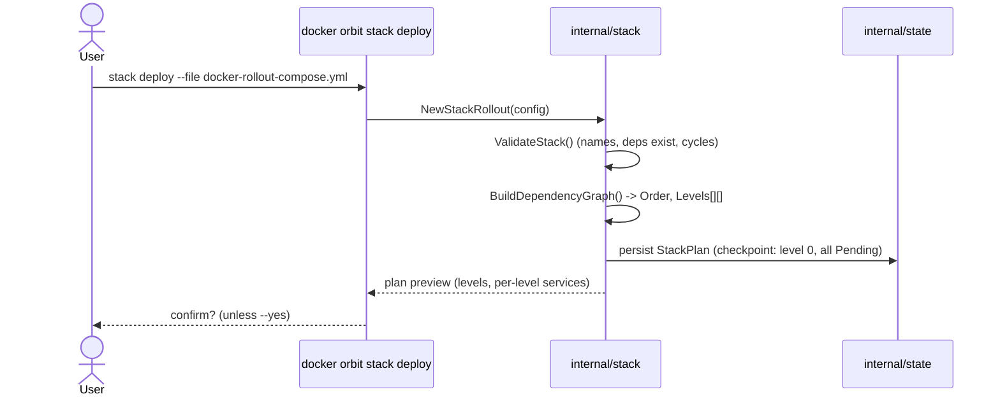

# Stack Orchestration — Multi-Service Deployment Design (Orbit v2)

> **Status: EXPERIMENTAL — frozen for Orbit v2.**
> `internal/stack` is not wired into any command in v1. It is the unfinished
> home of Orbit's future multi-service orchestration layer. This document
> defines how it must evolve. See [ADR-0005](../adr/ADR-0005-multi-service-orchestration-architecture.md)
> for the decision record and [internal/stack/README.md](../../internal/stack/README.md)
> for the freeze status.

---

## 1. Goals

Orbit v1 delivers zero-downtime deployment for **one service at a time**
(`internal/rollout`). Real Compose stacks are graphs of interdependent services.
Orbit v2 introduces **`docker orbit stack deploy`**: deploy an entire stack in
**dependency order**, rolling independent services in parallel, gating each
level on the previous level's health, and rolling the whole batch back on
failure.

**Non-goal (the load-bearing constraint):** the stack layer must **never become
a second deployment engine.** It orchestrates; it does not create containers,
switch traffic, or persist recovery state itself. Every per-service action is
delegated to the already-shipped, already-tested `internal/rollout`.

## 2. v2 Architecture

```text
                    docker orbit stack deploy          (v2 CLI — not built in v1)
                              │
                              ▼
        ┌───────────────────────────────────────────────┐
        │                internal/stack                  │  ORCHESTRATION ONLY
        │  • dependency graph      • level scheduling     │
        │  • batch rollback        • orchestration state  │
        │  • blast-radius policy   • progress aggregation │
        └───────────────────────────────────────────────┘
                              │  per service, one at a time within a level
                              ▼
        ┌───────────────────────────────────────────────┐
        │               internal/rollout                 │  SINGLE-SERVICE ENGINE
        │  Run(ctx, Options) / Rollback(ctx, state)       │  (unchanged from v1)
        └───────────────────────────────────────────────┘
                              │
                ┌─────────────┴─────────────┐
                ▼                           ▼
        internal/proxy               internal/state
      traffic / draining        persistence / recovery / authority
                │
                ▼
          Docker Engine
```

The arrows only ever point **downward**. `internal/stack` calls
`internal/rollout`; it never reaches around it to Docker, the proxy, or the
state store directly.

## 3. Responsibility Matrix

| Concern | Owner | `internal/stack` may… |
|---|---|---|
| Dependency graph, topological order, levels | **stack** | build & own it |
| Level scheduling & parallelism | **stack** | schedule; bounded by `ParallelDegree` |
| Batch (multi-service) rollback coordination | **stack** | decide *which* services to roll back, in what order |
| Orchestration state (which level, which services done) | **stack** | own it, persisted **via** `internal/state` |
| Blast-radius / failure containment policy | **stack** | decide policy; execute **via** rollout |
| Single-service deploy (scale, health, register, drain, remove) | **rollout** | **call only** — never reimplement |
| Traffic switching / backend registration / draining | **proxy** (via rollout's control-API calls) | **never touch directly** |
| Docker container create/start/stop/remove/inspect | **rollout** | **never touch directly** |
| Persistence, WAL/checkpoints, crash recovery, authority | **state** | **delegate only** — never duplicate |

**Hard prohibitions for `internal/stack` (v2):** must NOT create containers,
call the Docker SDK/CLI, switch traffic, implement per-service health polling,
or run its own persistence/WAL. Each of these already has a canonical owner.

## 4. Integration Design — how stack invokes rollout

`internal/stack` treats `internal/rollout` as a black-box worker with two
entry points already present in v1:

- `rollout.Run(ctx, rollout.Options{Service, ...}, log)` — deploy one service.
- `rollout.Rollback(ctx, rollout.RolloutState, log, progress)` — undo one service.

The lock (`rollout.AcquireLock`) remains **per service**, acquired by stack
before each `Run`, so a stack deploy and a manual single-service deploy of the
same service still mutually exclude.

### 4.1 How a stack deployment begins



### 4.2 How dependency levels are executed

```mermaid
sequenceDiagram
    participant Stack as internal/stack
    participant Rollout as internal/rollout
    participant Proxy as internal/proxy
    participant State as internal/state
    loop for each level L in Levels
        Stack->>State: checkpoint(level=L, status=InProgress)
        par up to ParallelDegree services in level L
            Stack->>Rollout: AcquireLock(svc) + Run(ctx, Options{svc})
            Rollout->>Proxy: register new backend / drain+remove old
            Rollout-->>Stack: ok(newGeneration) | error
        end
        alt all services in L healthy
            Stack->>State: checkpoint(level=L, status=Completed)
        else any failure
            Stack->>Stack: trigger batch rollback (see 4.4)
        end
    end
    Stack->>State: checkpoint(status=Completed); clear plan
```

### 4.3 How failures propagate

A single `rollout.Run` error marks that service `Failed`, sets the level
`Failed`, and **halts scheduling of any further levels**. In-flight services in
the *same* level are allowed to finish (they already committed) or are
cancelled via `ctx` if still pre-commit. Failure never silently continues to
the next level.

### 4.4 How rollbacks are coordinated

```mermaid
sequenceDiagram
    participant Stack as internal/stack
    participant Rollout as internal/rollout
    participant State as internal/state
    Note over Stack: A service in level L failed
    Stack->>State: load rollout state for each completed service
    loop completed services, REVERSE dependency order (level L-1, L-2, ...)
        Stack->>Rollout: Rollback(ctx, savedState[svc])
        Rollout-->>Stack: restored previous generation
    end
    Stack->>State: checkpoint(status=RolledBack); clear plan
```

Batch rollback reuses `rollout.Rollback` **per service**, walking the completed
set in reverse dependency order so dependents are restored before their
dependencies are disturbed.

### 4.5 How progress is reported

Stack aggregates the per-service `rollout.ProgressFunc` callbacks (already in
v1) into a stack-level progress stream: `(level, service, phase, detail)`. No
new reporting mechanism — it fans in the existing one.

### 4.6 How recovery resumes after interruption

On restart, stack loads its last checkpoint from `internal/state` (never its
own store): the last completed level and per-service authority. It then asks
`internal/rollout`/`internal/state` to reconcile each service independently
(v1 recovery already does this per service), and resumes scheduling at the
first non-completed level — or coordinates rollback if the checkpoint recorded
an in-progress failure.

## 5. Execution Model

```text
Validate stack (names, deps defined, no cycles)
        │  fail → abort, nothing changed
        ▼
Build dependency graph (Kahn topo-sort) → Levels[][]
        │
        ▼
Checkpoint plan to internal/state (level 0, all Pending)
        │
        ▼
┌───────────────────────────────────────────────┐
│ for level L = 0 .. N:                          │
│   checkpoint(L, InProgress)                     │
│   deploy services in L (parallel ≤ ParallelDeg) │
│     each = rollout.AcquireLock + rollout.Run    │
│   wait for all in L to report healthy           │
│     any failure → BATCH ROLLBACK, stop          │
│   checkpoint(L, Completed)                       │
└───────────────────────────────────────────────┘
        │
        ▼
Checkpoint(Completed); clear plan → done
```

**Rollback behavior per failure point:**

| Failure point | Behavior |
|---|---|
| Validation / graph build | Abort. Nothing deployed. No rollback needed. |
| Service fails in level 0 | Roll back that service (`rollout.Rollback`); no prior levels. |
| Service fails in level L>0 | Roll back all completed services in reverse dependency order; stop scheduling. |
| Interruption (crash) mid-level | On restart, resume from checkpoint: reconcile each service, then continue or roll back per recorded status. |
| Rollback itself fails for a service | Log, continue rolling back the rest (best-effort), mark stack `Degraded`, surface exactly which service is stuck. |

## 6. State Model

Stack state is **thin coordination metadata layered on top of `internal/state`**,
never a parallel persistence engine.

| State | Fields (conceptual) | Persisted by |
|---|---|---|
| **StackState** | plan id, compose file, `Levels[][]`, current level, overall status (`Planning/InProgress/Completed/RolledBack/Degraded`) | `internal/state` |
| **ServiceState** | service, status (`Pending/Rolling/Completed/Failed/RolledBack`), assigned level, last generation | `internal/state` (authority) + in-mem |
| **DeploymentState (level)** | level index, member services, level status, started/completed at | `internal/state` checkpoint |
| **RollbackState** | services to undo (reverse-ordered), per-service `rollout.RolloutState` reference | reuses v1 `/tmp/orbit-<svc>-state.json` via rollout |
| **RecoveryCheckpoint** | last completed level, in-flight service set, monotonically increasing epoch | `internal/state` (existing epoch/authority model) |

**Rule:** the per-service rollback state is *already* what `rollout` saves
(`RolloutState`). Stack references it; it does not copy or re-serialize it.
Stack's own additions are only the *coordination* fields (level cursor, plan).

## 7. Technical Debt Register (must resolve before activation)

Priority: **P0** = blocks any real use · **P1** = blocks production · **P2** = quality.

| # | Item | Evidence | Priority | Resolution |
|---|---|---|---|---|
| 1 | **Duplicate deployment engine** | `docker_integration.go` (`RolloutService`, `SwitchTraffic`, `DrainConnections`, `CleanupOldContainer`) reimplements rollout | **P0** | Delete; replace with calls to `rollout.Run`/`Rollback` |
| 2 | **Placeholder Docker client** | `docker_client.go` `RealDockerClient` returns `mock-<name>-<ts>` | **P0** | Delete; stack must not touch Docker |
| 3 | **Second (real) Docker client** | `docker_sdk_client.go` imports `docker/docker/client` (SDK) | **P0** | Delete; Docker interaction is rollout's job |
| 4 | **Duplicate persistence/WAL** | `state_persistence.go` (WAL, checkpoints, `RecoverFromCrash`, checksums) | **P0** | Delete; delegate to `internal/state` |
| 5 | **Data race on `StackRollout.state`** | no mutex; documented races (`TestTransactionFullRollout`, `TestEmitEvent`) | **P0** | Add synchronization or per-service channels before any parallel execution |
| 6 | **Missing orchestration driver** | `stack_rollout.go` exposes pieces but no top-level `Execute()` level loop | **P1** | Implement the level-walk driver (Section 5) |
| 7 | **Transaction drives placeholder client** | `docker_transaction.go` ops call the stub client | **P1** | Keep the compensating-rollback *pattern*; retarget ops at `rollout` |
| 8 | **Overlapping health monitor** | `health_monitor.go` polls container health via `DockerClient` | **P1** | Drop per-container polling; consume rollout/proxy health signals |
| 9 | **Overlapping observability** | `observability.go` reimplements metrics/Prometheus hooks | **P2** | Consolidate onto `internal/metrics` |
| 10 | **Docker SDK vuln exposure** | `SECURITY.md`: docker v24 CVE bump risk concentrated in stack | **P2** | Resolves for free once #2/#3 remove the SDK dependency |
| 11 | **Duplicate type system** | `docker_types.go` (`ContainerInfo`, `HealthStatus`, `RunOptions`) mirrors rollout/proxy | **P2** | Drop the `DockerClient` interface; keep only orchestration-neutral types actually reused |

## 8. What is reusable vs. rewrite vs. discard (per file)

| File | Verdict | Rationale |
|---|---|---|
| `dependency_graph.go` | **KEEP UNCHANGED** | Correct Kahn topo-sort + DFS cycle detection + level bucketing. Production quality. The crown jewel. |
| `models.go` | **KEEP (trim)** | Good type vocabulary; remove exec-coupled fields (`OldContainer`/`NewContainer` become references to rollout state). |
| `stack_rollout.go` | **KEEP core, REWRITE concurrency** | Sound state machine; add mutex + the missing driver loop. |
| `health_check.go` | **KEEP** | Circuit-breaker/dependency-health logic is orchestration-level and legitimately stack-owned. |
| `network_policy.go` | **KEEP idea, REWRITE execution** | Blast-radius/quarantine is **unique and valuable**; retarget its `killService`/`rollbackService` at rollout. |
| `docker_transaction.go` | **KEEP pattern, REWRITE ops** | Compensating reverse-order rollback is the right shape; ops must delegate. |
| `observability.go` | **CONSOLIDATE** | Fold into `internal/metrics`. |
| `health_monitor.go` | **DISCARD/REWRITE** | Health polling belongs to rollout/proxy. |
| `docker_integration.go` | **DISCARD** | Duplicate single-service engine. |
| `docker_client.go` (Real) | **DISCARD** | Placeholder. |
| `docker_client.go` (Mock) | **KEEP (test-only)** or replace with rollout fakes. |
| `docker_sdk_client.go` | **DISCARD** | Docker interaction is not stack's job. |
| `docker_types.go` | **DISCARD interface** | Keep only neutral types actually reused. |

## 9. Recovery Model

Stack recovery is **derived**, not independent. It never invents authority. On
restart it: (1) loads the plan checkpoint from `internal/state`; (2) for each
service, lets the existing v1 per-service recovery determine that service's
authoritative generation; (3) resumes at the first incomplete level, or
coordinates batch rollback if the checkpoint recorded an in-flight failure.
Because per-service authority is owned by `internal/state`, an interrupted
stack deploy degrades to N independent, already-correct single-service
recoveries plus a thin "which level were we on" cursor.

## 10. Future Roadmap

| Milestone | Capability | Depends on |
|---|---|---|
| v2.0 | `docker orbit stack deploy` — dependency-ordered, level-parallel, batch rollback | Debt #1–#7 resolved |
| v2.1 | Blast-radius containment (quarantine on failure) | `network_policy.go` rewired (#8 idea) |
| v2.2 | Deployment groups (named subsets of the graph) | level abstraction generalized |
| v3.0 | Multi-host orchestration | net-new; no current foundation in stack |

Multi-host is explicitly **not** served by today's `internal/stack` and will
require new design; everything else in the roadmap builds on the dependency
graph that already exists.
